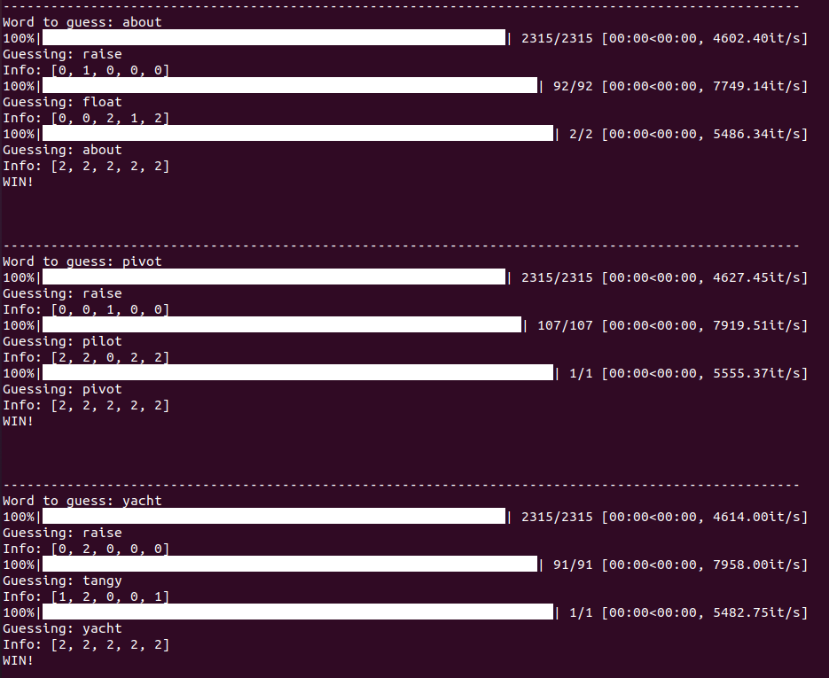
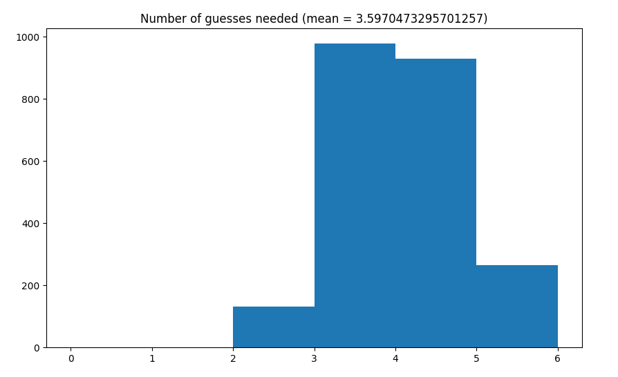

# Wordle-Bot
An entropy-based strategy to wordle


Inspired by [3Blue1Brown](https://www.youtube.com/watch?v=v68zYyaEmEA)

## Install & Run

1. Clone the script: 
```bash
git clone https://github.com/GillesVandewiele/Wordle-Bot.git
```

2. Install tqdm and scipy
```bash
(python -m) pip install tqdm scipy
```

3. Run the script (it will generate 10 random words and apply the strategy)
```bash
python wordle.py
```

4. There are some lines commented that will allow you to play interactively to solve the Wordle of the day.

## Example



## Statistics

I let the bot guess all the words in our word-list and generated a histogram of the required guesses. Can you do better?

